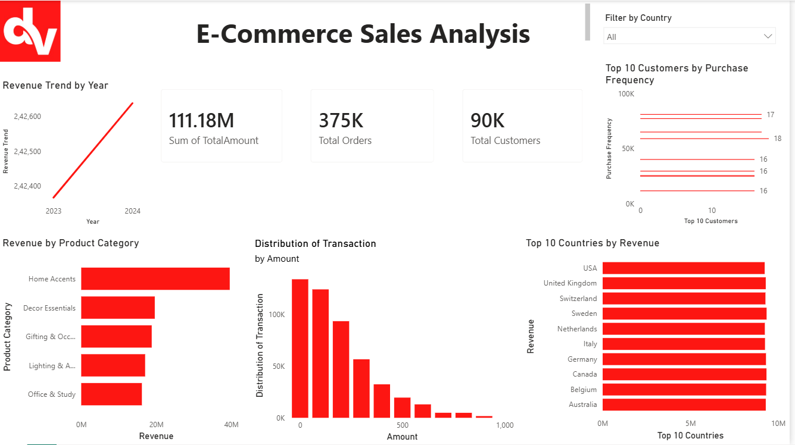

#🛒 E-Commerce-Sales-Dashboard

# 📌 Overview

This project focuses on analyzing e-commerce sales data to uncover key business insights and support data-driven decision-making. The dashboard provides a comprehensive view of sales performance, customer behavior, and product trends.

## 🎯 Objectives
Analyze sales performance across different regions and categories
Identify top-performing products and customer segments
Track key business KPIs such as revenue, profit, and order volume
Enable stakeholders to make informed decisions using visual insights

## 🧰 Tools & Technologies
Power BI – Dashboard creation and data visualization
SQL – Data extraction, transformation, and analysis
Excel – Data cleaning and preprocessing
Python (optional) – Data manipulation and exploratory analysis

## 📊 Key Features
Interactive dashboard with filters (region, category, date)
KPI tracking: Total Sales, Profit, Orders, and Quantity
Top products and category-wise performance analysis
Customer segmentation insights
Sales trend analysis over time

## 🔍 Data Analysis Process
Data Collection – Imported raw e-commerce dataset
Data Cleaning – Removed duplicates, handled missing values, standardized formats
Data Transformation – Used SQL and Excel for aggregations and joins
Exploratory Data Analysis (EDA) – Identified trends and patterns
Visualization – Built interactive dashboards using Power BI

## 📈 Key Insights
Tier 3 cities contributed significantly to overall sales growth
Certain product categories generated higher profit margins
Seasonal trends impacted sales performance
A small percentage of customers contributed to a large portion of revenue

## 🚀 Outcomes
Improved visibility into sales performance
Enabled data-driven decision-making
Identified opportunities for revenue growth and cost optimization

## 📸 Dashboard Preview

